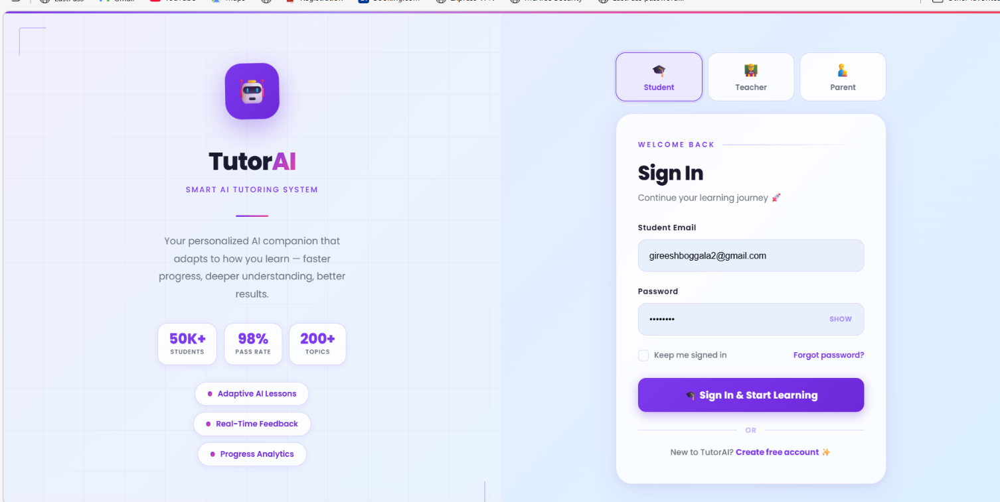
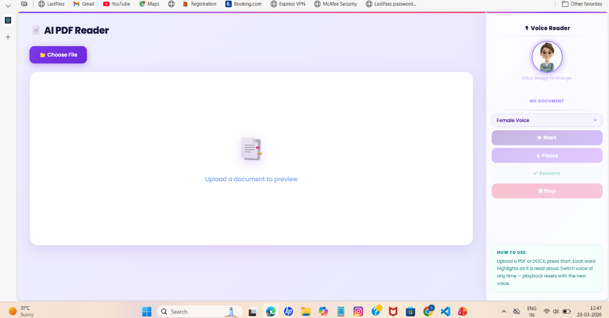
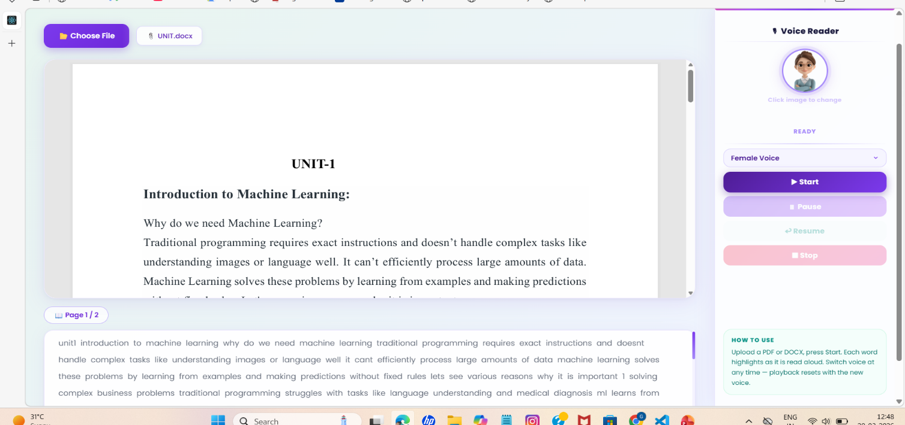
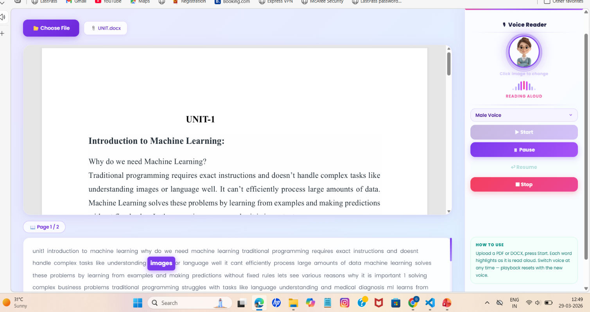
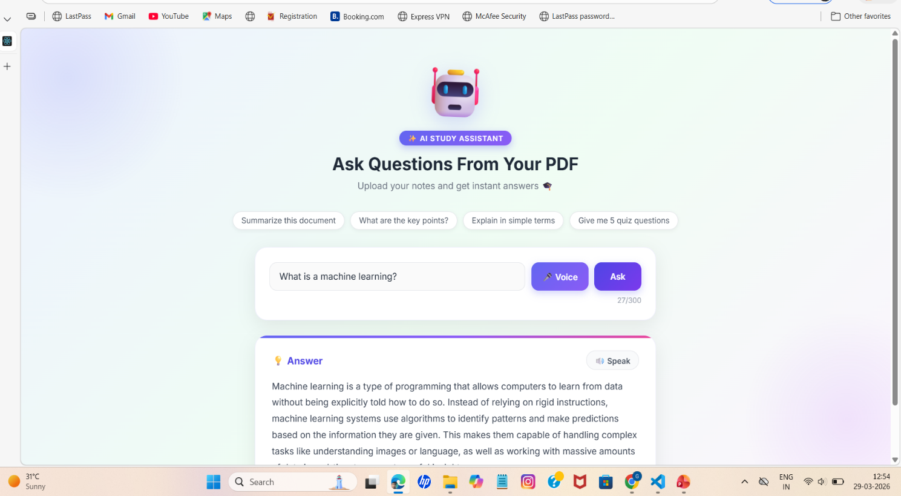

# 🎓 Smart AI-Based Tutoring System Using NLP, Speech Processing, and Learning Analytics

> An intelligent AI-powered virtual teacher that converts documents into interactive voice-based learning using NLP, Speech Processing, and Learning Analytics.


---

## 📌 Overview

The **Smart AI-Based Tutoring System** is a full-stack web application designed to act as a **virtual teacher**. It allows users to upload documents and converts them into **audio-assisted learning content**.

This system integrates:

- 🧠 **Natural Language Processing (NLP)** for understanding content  
- 🔊 **Speech Processing** for voice-based learning  
- 📊 **Learning Analytics** to track user interactions  

---
---

# 📸 Project Screenshots

## 🏠 Home Page



---

## 📄 Document Upload



---

## 👀 PDF Viewer



---

## 🔊 AI Voice Assistant



---

## 🏗 Output 



---

## 🎯 Objectives

- Develop an AI-powered tutoring system  
- Convert documents into audio learning  
- Improve accessibility for visually impaired users  
- Provide hands-free learning experience  
- Analyze user learning behavior  

---

## ✨ Features

| Feature | Description |
|--------|------------|
| 📄 Multi-format Upload | Supports PDF, DOCX, PPTX |
| 🔄 Auto Conversion | Converts DOCX & PPTX to PDF |
| 👀 In-browser Viewer | View document while listening |
| 🧠 Page-wise Extraction | Extract text per page |
| 🔊 AI Voice Reading | Reads content using speech API |
| ⏯ Playback Controls | Start, Pause, Resume, Stop |
| 🎙 Voice Selection | Male / Female voices |
| 📖 Auto Page Scroll | Moves to next page automatically |
| 🗄 Database Storage | Stores extracted content |

---

## 🧠 System Modules & Implementation

### 1️⃣ Document Upload & Processing Module

**Implementation:**
- Users upload files (PDF, DOCX, PPTX)
- Flask backend handles file upload
- DOCX/PPTX converted to PDF

**Technologies:**
- Flask
- docx2pdf
- python-pptx

**Flow:**
Upload → Backend → Conversion → Storage

---

### 2️⃣ Text Extraction Module

**Implementation:**
- Extract text using `pdfplumber`
- Page-wise extraction for synchronization
- Stored in MySQL database

**Flow:**
PDF → Text Extraction → Database

---

### 3️⃣ AI Voice Assistant Module (Speech Processing)

**Implementation:**
- Uses Web Speech API
- Provides playback controls

**Features:**
- Play / Pause / Resume / Stop  
- Voice selection  

**Flow:**
Text → Speech Engine → Audio Output

---

### 4️⃣ Frontend Viewer Module

**Implementation:**
- Built using React
- Displays PDF and controls audio

**Components:**
- PDFViewer.jsx  
- AIVoiceAssistant.jsx  

---

### 5️⃣ Backend API Module

**Implementation:**
- REST APIs using Flask

**Endpoints:**
- POST `/upload`
- GET `/pdf/<filename>`
- GET `/pdf_text_pages`

---

### 6️⃣ Learning Analytics Module

**Implementation:**
- Tracks:
  - Pages read  
  - Playback actions  
- Stores user interaction data  

---

## 🏗️ System Architecture

```
┌─────────────────────────────────────────────┐
│                 Frontend (React)            │
│                                             │
│  ┌─────────────┐      ┌──────────────────┐  │
│  │  PDFViewer  │      │ AIVoiceAssistant │  │
│  │  • Upload   │      │  • Speech Synth  │  │
│  │  • Render   │      │  • Controls      │  │
│  │  • Extract  │      │  • Voice Select  │  │
│  └──────┬──────┘      └────────┬─────────┘  │
│         └──────────┬───────────┘            │
│               App.jsx                       │
│           (Shared pdfText state)            │
└───────────────────┬─────────────────────────┘
                    │ HTTP (Axios)
┌───────────────────▼─────────────────────────┐
│                Backend (Flask)              │
│                                             │
│  • Upload API       • PDF Text Extractor    │
│  • File Converter   • MySQL Storage         │
│  • Static File Server                       │
└─────────────────────────────────────────────┘
```

---

## 🧑‍💻 Tech Stack

### Frontend
- **React 18** — UI framework
- **Axios** — HTTP requests
- **Web Speech API** — Browser-native voice synthesis
- **CSS3** — Styling

### Backend
- **Python / Flask** — REST API server
- **pdfplumber** — PDF text extraction
- **docx2pdf** — DOCX to PDF conversion
- **python-pptx** — PPTX to PDF conversion
- **Flask-CORS** — Cross-origin support
- **mysql-connector-python** — Database layer

### Database
- **MySQL 8.0** — Stores document names and extracted text

---

## 📂 Project Structure

```
ai-pdf-reader/
│
├── backend/
│   ├── app.py                  # Flask application entry point
│   ├── requirements.txt        # Python dependencies
│   └── uploads/                # Uploaded & converted files (auto-created)
│
├── frontend/
│   ├── public/
│   ├── src/
│   │   ├── App.jsx             # Root component & shared state
│   │   ├── PDFViewer.jsx       # Upload, render, and extract PDF text
│   │   ├── PDFViewer.css
│   │   ├── AIVoiceAssistant.jsx # Voice reading & playback controls
│   │   └── AIVoiceAssistant.css
│   └── package.json
│
└── README.md
```

---

## 🛠️ Setup Instructions

### Prerequisites

- Node.js 18+
- Python 3.10+
- MySQL 8.0+

---

### 1️⃣ Database Setup

Open your MySQL client and run:

```sql
CREATE DATABASE ai_teacher;

USE ai_teacher;

CREATE TABLE pdf_knowledge (
  id        INT AUTO_INCREMENT PRIMARY KEY,
  pdf_name  VARCHAR(255),
  content   LONGTEXT
);
```

---

### 2️⃣ Backend Setup

```bash
# Navigate to backend directory
cd backend

# Create and activate virtual environment
python -m venv venv

# Windows
venv\Scripts\activate

# macOS / Linux
source venv/bin/activate

# Install dependencies
pip install -r requirements.txt

# Start the Flask server
python app.py
```

> Backend runs at **http://127.0.0.1:5000**

---

### 3️⃣ Frontend Setup

```bash
# Navigate to frontend directory
cd frontend

# Install dependencies
npm install

# Start the React app
npm start
```

> Frontend runs at **http://localhost:3000**

---

## 🔌 API Endpoints

| Method | Endpoint | Description |
|--------|----------|-------------|
| `POST` | `/upload` | Upload a PDF / DOCX / PPTX file |
| `GET` | `/pdf/<filename>` | Serve the converted PDF file |
| `GET` | `/pdf_text_pages` | Get page-wise extracted text |
| `GET` | `/explain_pdf` | AI summary of document *(optional)* |

---

## 🎯 How It Works

```
1. User uploads a document (PDF / DOCX / PPTX)
        ↓
2. Backend converts it to PDF (if needed)
        ↓
3. PDF is rendered in the browser via iframe
        ↓
4. Text is extracted page-by-page and stored in MySQL
        ↓
5. Extracted text is sent to the React frontend
        ↓
6. AI Voice Assistant reads the text aloud
        ↓
7. PDF auto-scrolls to the next page when current page is fully read
```

---

## ✅ Current Capabilities

- ✔ Full document reading with AI voice
- ✔ Smooth Pause and Resume support
- ✔ Auto page advance when reading completes a page
- ✔ Male / Female voice selection
- ✔ Clean, distraction-free UI
- ✔ Stable Flask backend with MySQL persistence

---

## 🔮 Roadmap

- [ ] Word-level highlighting inside the PDF
- [ ] Question & Answer from document content
- [ ] Google Neural TTS integration
- [ ] Multi-language support
- [ ] Mobile-responsive UI
- [ ] User authentication and document history

---

## 👥 Use Cases

- 🎓 **Students** — Listen to study material while viewing notes
- 👁 **Visually impaired users** — Full audio-assisted document reading
- 🏫 **Online education platforms** — AI-powered lecture delivery
- 📚 **Self-learners** — Hands-free reading of books and articles
- 🤖 **AI teaching tools** — Automated virtual classroom assistant

---

## 👨‍🎓 Author

**Gireesh Boggala**
AI Virtual Teacher Project — College Final Year Project

---

## 🧾 License

This project is developed for **educational and research purposes only**.
